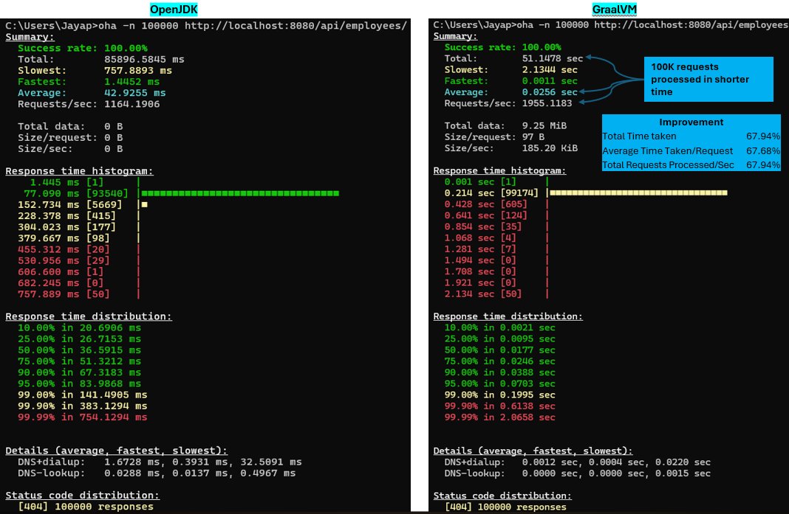
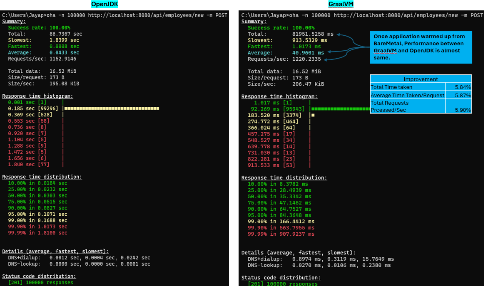

# GraalVM - OpenJDK Performance comparison

# 1. Intro
## 1.1 Brief
* To compare the performance of JDK & GraalVM Native Image.
* Created a Simple Employee CRUD API application using SpringBoot 4.0.0 and Java 25. 
* Created controller, Service, Repository & Entity Classes.
* CRUD operations with MongoDB.

## 1.2 Created few APIs for testing:
1. POST /api/employees/new - Create new employee
2. GET /api/employees/ - Fetch employee by random empId
3. GET /api/employees/{id} - Fetch employee by id
4. GET /api/employees - Fetch all employees
5. PUT /api/employees/{id} - Update employee by id
6. DELETE /api/employees/{id} - Delete employee by id

## 1.3 Testing
* We are going to test only first 2 endpoints.
* We are going to use oha tool to do load testing on these APIs.

## 1.4 Installation of oha
oha is a tiny TUI based program that sends some load to a web application and show realtime tui inspired by rakyll/hey.
We are going to use this tool for load testing our application.

https://github.com/hatoo/oha

# 2. Tests of OpenJDK & GraalVM
## 2.1 README for JDK 
[README_JDK.md](README_JDK.md)
## 2.2 README for GraalVM 
[README_GraalVM.md](README_GraalVM.md)

# 3. NFR Analysis

## 3.1 Performance improvement due to Startup Time
* GET with no data (Startup from BareMetel):-

## 3.2 Performance after servers warmed-up
* POST (Already started springBoot Server):-
  Once application warmed up from BareMetal, Performance between GraalVM and OpenJDK is almost same. Because there is no warmup time delay.
  

## 3.3 Memory Footprint

## 3.4 Startup Time - Benchmarked

## Advantages
* Better performance with no code changes
* Lower memory Footprint
* Fastest Startup Time
* Supported in all industry-leading Java application frameworks & Cloud Platforms
* Improved Security

## TradeOff
* GraalVM requires tools to creative native images. Eg:- VS Code & C++ tools for Windows.
* While GraalVM provide better performance and startup time, the native image compilation process takes longer time. This will increase CICD time.
* Efficient for smaller applications
* No thread dump and heap dump support
