# Application using GraalVM JDK 25

## Pre-requesties
* Install GraalVM JDK 25 https://www.graalvm.org/latest/getting-started/windows/

## 1 Build
### 1.1 Build Steps
```
mvn clean compile
mvn spring-boot:process-aot
mvn native:compile
```

### 1.2 Build Log

```
  .   ____          _            __ _ _
 /\\ / ___'_ __ _ _(_)_ __  __ _ \ \ \ \
( ( )\___ | '_ | '_| | '_ \/ _` | \ \ \ \
 \\/  ___)| |_)| | | | | || (_| |  ) ) ) )
  '  |____| .__|_| |_|_| |_\__, | / / / /
 =========|_|==============|___/=/_/_/_/

 :: Spring Boot ::       (v4.0.0-SNAPSHOT)

2025-10-16T23:57:21.443+02:00  INFO 16228 --- [graalvm-performance-test] [           main] [                                                 ] g.GraalvmPerformanceTestApplicationTests : Starting GraalvmPerformanceTestApplicationTests using Java 25 with PID 16228 (started by Jayap in C:\Users\Jayap\IdeaProjects\graalvm-performance-test)
2025-10-16T23:57:21.453+02:00  INFO 16228 --- [graalvm-performance-test] [           main] [                                                 ] g.GraalvmPerformanceTestApplicationTests : No active profile set, falling back to 1 default profile: "default"
2025-10-16T23:57:22.834+02:00  INFO 16228 --- [graalvm-performance-test] [           main] [                                                 ] .s.d.r.c.RepositoryConfigurationDelegate : Bootstrapping Spring Data MongoDB repositories in DEFAULT mode.
2025-10-16T23:57:22.936+02:00  INFO 16228 --- [graalvm-performance-test] [           main] [                                                 ] .s.d.r.c.RepositoryConfigurationDelegate : Finished Spring Data repository scanning in 91 ms. Found 1 MongoDB repository interface.
2025-10-16T23:57:23.852+02:00  INFO 16228 --- [graalvm-performance-test] [           main] [                                                 ] org.mongodb.driver.client                : MongoClient with metadata {"driver": {"name": "mongo-java-driver|spring-boot|sync", "version": "5.6.1"}, "os": {"type": "Windows", "name": "Windows 11", "architecture": "amd64", "version": "10.0"}, "platform": "Java/Oracle Corporation/25+37-LTS-jvmci-b01"} created with settings MongoClientSettings{readPreference=primary, writeConcern=WriteConcern{w=null, wTimeout=null ms, journal=null}, retryWrites=true, retryReads=true, readConcern=ReadConcern{level=null}, credential=null, transportSettings=null, commandListeners=[io.micrometer.core.instrument.binder.mongodb.MongoMetricsCommandListener@6f96dd64], codecRegistry=ProvidersCodecRegistry{codecProviders=[ValueCodecProvider{}, BsonValueCodecProvider{}, DBRefCodecProvider{}, DBObjectCodecProvider{}, DocumentCodecProvider{}, CollectionCodecProvider{}, IterableCodecProvider{}, MapCodecProvider{}, GeoJsonCodecProvider{}, GridFSFileCodecProvider{}, Jsr310CodecProvider{}, JsonObjectCodecProvider{}, BsonCodecProvider{}, com.mongodb.client.model.mql.ExpressionCodecProvider@4d7cac24, com.mongodb.Jep395RecordCodecProvider@409732fb, com.mongodb.KotlinCodecProvider@73d62b5, EnumCodecProvider{}]}, loggerSettings=LoggerSettings{maxDocumentLength=1000}, clusterSettings={hosts=[localhost:27017], srvServiceName=mongodb, mode=SINGLE, requiredClusterType=UNKNOWN, requiredReplicaSetName='null', serverSelector='null', clusterListeners='[]', serverSelectionTimeout='30000 ms', localThreshold='15 ms'}, socketSettings=SocketSettings{connectTimeoutMS=10000, readTimeoutMS=0, receiveBufferSize=0, proxySettings=ProxySettings{host=null, port=null, username=null, password=null}}, heartbeatSocketSettings=SocketSettings{connectTimeoutMS=10000, readTimeoutMS=10000, receiveBufferSize=0, proxySettings=ProxySettings{host=null, port=null, username=null, password=null}}, connectionPoolSettings=ConnectionPoolSettings{maxSize=100, minSize=0, maxWaitTimeMS=120000, maxConnectionLifeTimeMS=0, maxConnectionIdleTimeMS=0, maintenanceInitialDelayMS=0, maintenanceFrequencyMS=60000, connectionPoolListeners=[io.micrometer.core.instrument.binder.mongodb.MongoMetricsConnectionPoolListener@5e99e2cb], maxConnecting=2}, serverSettings=ServerSettings{heartbeatFrequencyMS=10000, minHeartbeatFrequencyMS=500, serverMonitoringMode=AUTO, serverListeners='[]', serverMonitorListeners='[]'}, sslSettings=SslSettings{enabled=false, invalidHostNameAllowed=false, context=null}, applicationName='null', compressorList=[], uuidRepresentation=UNSPECIFIED, serverApi=null, autoEncryptionSettings=null, dnsClient=null, inetAddressResolver=null, contextProvider=null, timeoutMS=null}
2025-10-16T23:57:23.982+02:00  INFO 16228 --- [graalvm-performance-test] [localhost:27017] [                                                 ] org.mongodb.driver.cluster               : Monitor thread successfully connected to server with description ServerDescription{address=localhost:27017, type=STANDALONE, cryptd=false, state=CONNECTED, ok=true, minWireVersion=0, maxWireVersion=27, maxDocumentSize=16777216, logicalSessionTimeoutMinutes=30, roundTripTimeNanos=37988200, minRoundTripTimeNanos=0}
2025-10-16T23:57:25.485+02:00  INFO 16228 --- [graalvm-performance-test] [           main] [                                                 ] o.s.b.a.e.web.EndpointLinksResolver      : Exposing 2 endpoints beneath base path '/actuator'
2025-10-16T23:57:25.594+02:00  INFO 16228 --- [graalvm-performance-test] [           main] [                                                 ] g.GraalvmPerformanceTestApplicationTests : Started GraalvmPerformanceTestApplicationTests in 4.705 seconds (process running for 6.917)
Mockito is currently self-attaching to enable the inline-mock-maker. This will no longer work in future releases of the JDK. Please add Mockito as an agent to your build as described in Mockito's documentation: https://javadoc.io/doc/org.mockito/mockito-core/latest/org.mockito/org/mockito/Mockito.html#0.3
WARNING: A Java agent has been loaded dynamically (C:\Users\Jayap\.m2\repository\net\bytebuddy\byte-buddy-agent\1.17.8\byte-buddy-agent-1.17.8.jar)
WARNING: If a serviceability tool is in use, please run with -XX:+EnableDynamicAgentLoading to hide this warning
WARNING: If a serviceability tool is not in use, please run with -Djdk.instrument.traceUsage for more information
WARNING: Dynamic loading of agents will be disallowed by default in a future release
Java HotSpot(TM) 64-Bit Server VM warning: Sharing is only supported for boot loader classes because bootstrap classpath has been appended
[INFO] Tests run: 1, Failures: 0, Errors: 0, Skipped: 0, Time elapsed: 6.848 s -- in io.jayaprabahar.graalvm.graalvm_performance_test.GraalvmPerformanceTestApplicationTests
[INFO]
[INFO] Results:
[INFO]
[INFO] Tests run: 1, Failures: 0, Errors: 0, Skipped: 0
[INFO]
[INFO]
[INFO] --- jar:3.4.2:jar (default-jar) @ graalvm-performance-test ---
[INFO] Building jar: C:\Users\Jayap\IdeaProjects\graalvm-performance-test\target\graalvm-performance-test-0.0.1-SNAPSHOT.jar
[INFO]
[INFO] --- spring-boot:4.0.0-SNAPSHOT:repackage (repackage) @ graalvm-performance-test ---
[INFO] Replacing main artifact C:\Users\Jayap\IdeaProjects\graalvm-performance-test\target\graalvm-performance-test-0.0.1-SNAPSHOT.jar with repackaged archive, adding nested dependencies in BOOT-INF/.
[INFO] The original artifact has been renamed to C:\Users\Jayap\IdeaProjects\graalvm-performance-test\target\graalvm-performance-test-0.0.1-SNAPSHOT.jar.original
[INFO]
[INFO] <<< native:0.11.1:compile (default-cli) < package @ graalvm-performance-test <<<
[INFO]
[INFO]
[INFO] --- native:0.11.1:compile (default-cli) @ graalvm-performance-test ---
[INFO] Found GraalVM installation from GRAALVM_HOME variable.
[INFO] Downloaded GraalVM reachability metadata repository from file:/C:/Users/Jayap/.m2/repository/org/graalvm/buildtools/graalvm-reachability-metadata/0.11.1/graalvm-reachability-metadata-0.11.1-repository.zip
[INFO] [graalvm reachability metadata repository for org.apache.tomcat.embed:tomcat-embed-core:11.0.13]: Configuration directory not found. Trying latest version.
[INFO] [graalvm reachability metadata repository for org.apache.tomcat.embed:tomcat-embed-core:11.0.13]: Configuration directory is org.apache.tomcat.embed\tomcat-embed-core\10.0.20
[WARNING] Properties file at 'jar:file:///C:/Users/Jayap/.m2/repository/org/mongodb/bson/5.6.1/bson-5.6.1.jar!/META-INF/native-image/native-image.properties' does not match the recommended 'META-INF/native-image/org.mongodb/bson/native-image.properties' layout.
[WARNING] Properties file at 'jar:file:///C:/Users/Jayap/.m2/repository/org/mongodb/mongodb-driver-core/5.6.1/mongodb-driver-core-5.6.1.jar!/META-INF/native-image/native-image.properties' does not match the recommended 'META-INF/native-image/org.mongodb/mongodb-driver-core/native-image.properties' layout.
[INFO] [graalvm reachability metadata repository for ch.qos.logback:logback-classic:1.5.19]: Configuration directory not found. Trying latest version.
[INFO] [graalvm reachability metadata repository for ch.qos.logback:logback-classic:1.5.19]: Configuration directory is ch.qos.logback\logback-classic\1.4.9
[INFO] [graalvm reachability metadata repository for org.hdrhistogram:HdrHistogram:2.2.2]: Configuration directory not found. Trying latest version.
[INFO] [graalvm reachability metadata repository for org.hdrhistogram:HdrHistogram:2.2.2]: Configuration directory is org.hdrhistogram\HdrHistogram\2.1.12
[INFO] [graalvm reachability metadata repository for commons-logging:commons-logging:1.3.5]: Configuration directory is commons-logging\commons-logging\1.2
[INFO] CycloneDX: Resolving Dependencies
[INFO] CycloneDX: Creating BOM version 1.5 with 67 component(s)
[INFO] CycloneDX: Writing and validating BOM (JSON): C:\Users\Jayap\IdeaProjects\graalvm-performance-test\target\base_sbom.json
[INFO]            attaching as graalvm-performance-test-0.0.1-SNAPSHOT-cyclonedx.json
[WARNING] No jdk toolchain configuration found
[INFO] Executing: C:\Users\Jayap\.jdks\graalvm-jdk-25\bin\native-image.cmd @target\tmp\native-image-18193445364862187764.args io.jayaprabahar.graalvm.graalvm_performance_test.GraalvmPerformanceTestApplication
Warning: Option 'DynamicProxyConfigurationResources' is deprecated and might be removed in a future release: This can be caused by a proxy-config.json file in your META-INF directory. Consider including proxy configuration in the reflection section of reachability-metadata.md instead.. Please refer to the GraalVM release notes.
========================================================================================================================
GraalVM Native Image: Generating 'graalvm-performance-test.exe' (executable)...
========================================================================================================================
For detailed information and explanations on the build output, visit:
https://github.com/oracle/graal/blob/master/docs/reference-manual/native-image/BuildOutput.md
------------------------------------------------------------------------------------------------------------------------
[1/8] Initializing...                                                                                   (17.8s @ 0.29GB)
 Java version: 25+37-LTS, vendor version: Oracle GraalVM 25+37.1
 Graal compiler: optimization level: b, target machine: native, PGO: off
 C compiler: cl.exe (microsoft, x64, 19.44.35217)
 Garbage collector: Serial GC (max heap size: 80% of RAM)
 2 user-specific feature(s):
 - com.oracle.svm.thirdparty.gson.GsonFeature
 - org.springframework.aot.nativex.feature.PreComputeFieldFeature
------------------------------------------------------------------------------------------------------------------------
Build resources:
 - 3.82GB of memory (11.2% of system memory, set via '-Xmx4G')
 - 4 thread(s) (100.0% of 4 available processor(s), determined at start)
SLF4J(W): No SLF4J providers were found.
SLF4J(W): Defaulting to no-operation (NOP) logger implementation
SLF4J(W): See https://www.slf4j.org/codes.html#noProviders for further details.
[2/8] Performing analysis...  [******]                                                                 (149.0s @ 2.27GB)
   23,455 types,  33,304 fields, and 115,644 methods found reachable
    8,177 types,   2,641 fields, and  12,059 methods registered for reflection
       78 types,      60 fields, and      68 methods registered for JNI access
        0 downcalls and 0 upcalls registered for foreign access
        5 native libraries: crypt32, ncrypt, psapi, version, winhttp
[3/8] Building universe...                                                                              (17.3s @ 2.61GB)
[4/8] Parsing methods...      [***]                                                                     (11.9s @ 2.82GB)
[5/8] Inlining methods...     [***]                                                                     (10.1s @ 1.91GB)
[6/8] Compiling methods...    [********]                                                                (75.4s @ 2.18GB)
[7/8] Laying out methods...   [****]                                                                    (12.2s @ 2.85GB)
[8/8] Creating image...       [****]                                                                    (15.2s @ 2.34GB)
  35.86MB (47.74%) for code area:    74,995 compilation units
  37.09MB (49.39%) for image heap:  510,936 objects and 451 resources
   2.15MB ( 2.87%) for other data
  75.10MB in total image size, 75.10MB in total file size
------------------------------------------------------------------------------------------------------------------------
Top 10 origins of code area:                                Top 10 object types in image heap:
   9.70MB java.base                                           10.64MB byte[] for code metadata
   5.87MB svm.jar (Native Image)                               7.03MB byte[] for java.lang.String
   3.23MB tomcat-embed-core-11.0.13.jar                        3.51MB java.lang.String
   2.71MB java.xml                                             3.10MB java.lang.Class
   1.20MB jackson-databind-3.0.0.jar                           2.44MB com.oracle.svm.core.hub.DynamicHubCompanion
   1.07MB mongodb-driver-core-5.6.1.jar                        1.11MB byte[] for reflection metadata
 968.04kB spring-core-7.0.0-SNAPSHOT.jar                     904.53kB byte[] for embedded resources
 860.32kB spring-boot-4.0.0-SNAPSHOT.jar                     898.76kB byte[] for general heap data
 757.22kB spring-data-mongodb-5.0.0-SNAPSHOT.jar             682.62kB c.o.svm.core.hub.DynamicHub$ReflectionMetadata
 717.54kB spring-data-commons-4.0.0-SNAPSHOT.jar             512.67kB java.util.concurrent.ConcurrentHashMap$Node
   7.60MB for 138 more packages                                6.26MB for 4961 more object types
                            Use '--emit build-report' to create a report with more details.
------------------------------------------------------------------------------------------------------------------------
Security report:
 - Binary includes Java deserialization.
 - CycloneDX SBOM with 61 component(s) is embedded in binary (2.83kB). 159 type(s) could not be associated to a component.
 - Advanced obfuscation not enabled; enable with '-H:AdvancedObfuscation=""' (experimental support).
------------------------------------------------------------------------------------------------------------------------
Recommendations:
 PGO:  Use Profile-Guided Optimizations ('--pgo') for improved throughput.
 FUTR: Use '--future-defaults=all' to prepare for future releases.
 AWT:  Use the tracing agent to collect metadata for AWT.
 HEAP: Set max heap for improved and more predictable memory usage.
------------------------------------------------------------------------------------------------------------------------
                       28.3s (8.9% of total time) in 1413 GCs | Peak RSS: 3.86GB | CPU load: 3.24
------------------------------------------------------------------------------------------------------------------------
Build artifacts:
 C:\Users\Jayap\IdeaProjects\graalvm-performance-test\target\awt.dll (jdk_library)
 C:\Users\Jayap\IdeaProjects\graalvm-performance-test\target\graalvm-performance-test.exe (executable)
 C:\Users\Jayap\IdeaProjects\graalvm-performance-test\target\java.dll (jdk_library_shim)
 C:\Users\Jayap\IdeaProjects\graalvm-performance-test\target\jvm.dll (jdk_library_shim)
========================================================================================================================
Finished generating 'graalvm-performance-test' in 5m 16s.
[INFO] ------------------------------------------------------------------------
[INFO] BUILD SUCCESS
[INFO] ------------------------------------------------------------------------
[INFO] Total time:  05:45 min
[INFO] Finished at: 2025-10-17T00:02:57+02:00
[INFO] ------------------------------------------------------------------------
```

### 1.3 Build Size
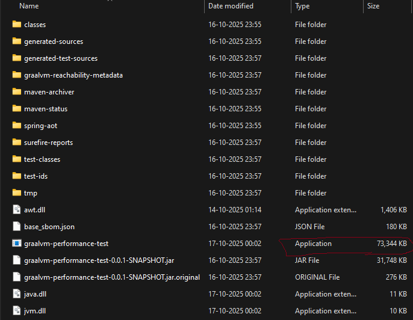

### 1.4 Build Time
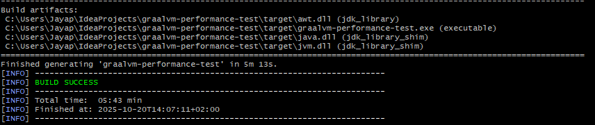

### 1.5 Build Impact on RAM
GraalVM Build creation has higher impact on RAM.

This can be tested by adjusting Xmx JVM argument inside org.graalvm.buildtools -> native-maven-plugin.

```
<plugin>
    <groupId>org.graalvm.buildtools</groupId>
    <artifactId>native-maven-plugin</artifactId>
    .
    .
            <buildArg>-J-Xmx16G</buildArg>                      
```
#### Build Performance with 2 GB JVM Config
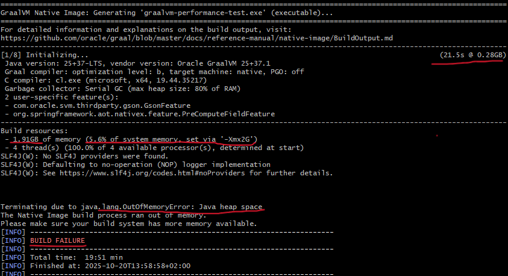
#### Build Performance with 16 GB JVM Config
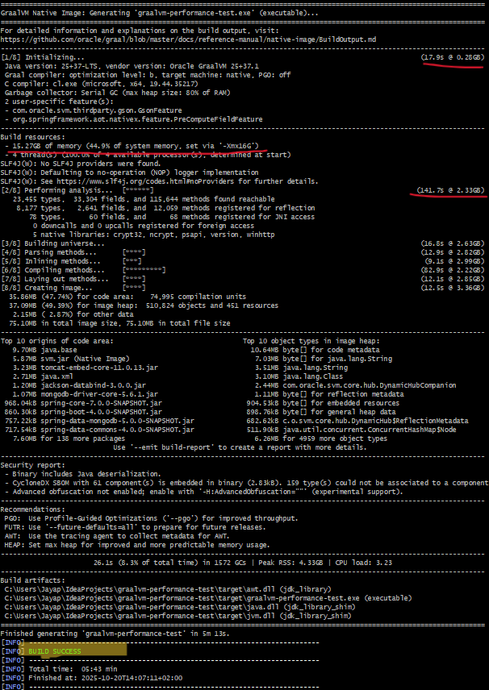
#### Build Performance with 32 GB JVM Config
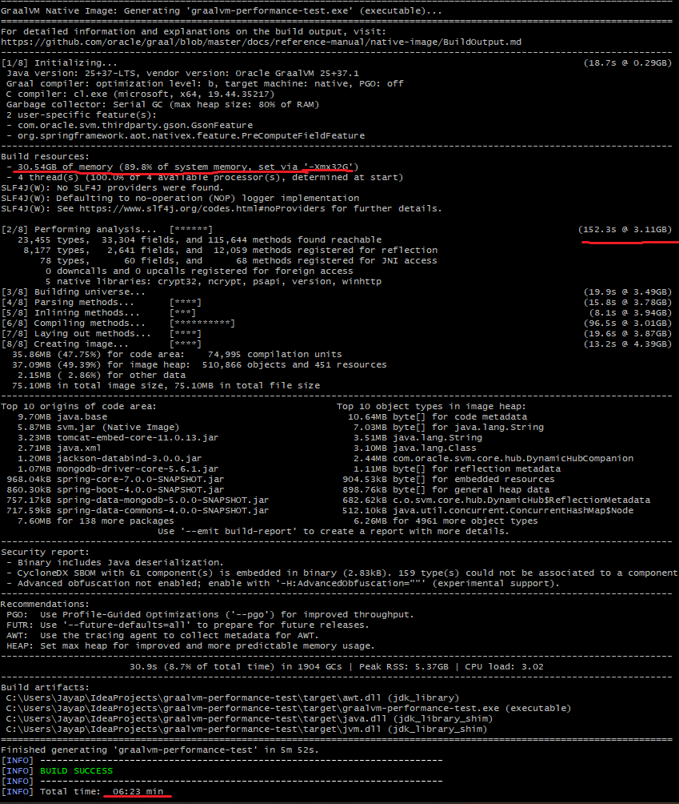

### 1.5 Build Impact on CPU
GraalVM Build has higher impact on CPU, due to RAM. This is because after creating usual spring-boot executable jar, it starts native image compilation process. 

```
[INFO] --- jar:3.4.2:jar (default-jar) @ graalvm-performance-test ---
[INFO] Building jar: C:\Users\Jayap\IdeaProjects\graalvm-performance-test\target\graalvm-performance-test-0.0.1-SNAPSHOT.jar
[INFO]
[INFO] --- spring-boot:4.0.0-SNAPSHOT:repackage (repackage) @ graalvm-performance-test ---
[INFO] Replacing main artifact C:\Users\Jayap\IdeaProjects\graalvm-performance-test\target\graalvm-performance-test-0.0.1-SNAPSHOT.jar with repackaged archive, adding nested dependencies in BOOT-INF/.
[INFO] The original artifact has been renamed to C:\Users\Jayap\IdeaProjects\graalvm-performance-test\target\graalvm-performance-test-0.0.1-SNAPSHOT.jar.original
[INFO]
[INFO] <<< native:0.11.1:compile (default-cli) < package @ graalvm-performance-test <<<
[INFO] Found GraalVM installation from GRAALVM_HOME variable.
[INFO] Downloaded GraalVM reachability metadata repository from file:/C:/Users/Jayap/.m2/repository/org/graalvm/buildtools/graalvm-reachability-metadata/0.11.1/graalvm-reachability-metadata-0.11.1-repository.zip
```

This requires lot of sequential steps, to finally create a native executable file. (*.exe for windows)

```
[1/8] Initializing...                                                                                   (18.7s @ 0.29GB)
[2/8] Performing analysis...  [******]                                                                 (152.3s @ 3.11GB)
[3/8] Building universe...                                                                              (19.9s @ 3.49GB)
[4/8] Parsing methods...      [****]                                                                    (15.8s @ 3.78GB)
[5/8] Inlining methods...     [***]                                                                      (8.1s @ 3.94GB)
[6/8] Compiling methods...    [**********]                                                              (96.5s @ 3.01GB)
[7/8] Laying out methods...   [****]                                                                    (19.6s @ 3.87GB)
[8/8] Creating image...       [****]                                                                    (13.2s @ 4.39GB)
```


## 2. Start-up Time

```
  .   ____          _            __ _ _
 /\\ / ___'_ __ _ _(_)_ __  __ _ \ \ \ \
( ( )\___ | '_ | '_| | '_ \/ _` | \ \ \ \
 \\/  ___)| |_)| | | | | || (_| |  ) ) ) )
  '  |____| .__|_| |_|_| |_\__, | / / / /
 =========|_|==============|___/=/_/_/_/

 :: Spring Boot ::       (v4.0.0-SNAPSHOT)

2025-10-20T14:21:37.601+02:00  INFO 15124 --- [graalvm-performance-test] [           main] [                                                 ] .j.g.g.GraalvmPerformanceTestApplication : Starting AOT-processed GraalvmPerformanceTestApplication using Java 25 with PID 15124 (C:\Users\Jayap\IdeaProjects\graalvm-performance-test\target\graalvm-performance-test.exe started by Jayap in C:\Users\Jayap\IdeaProjects\graalvm-performance-test\target)
2025-10-20T14:21:37.601+02:00  INFO 15124 --- [graalvm-performance-test] [           main] [                                                 ] .j.g.g.GraalvmPerformanceTestApplication : No active profile set, falling back to 1 default profile: "default"
2025-10-20T14:21:37.642+02:00  INFO 15124 --- [graalvm-performance-test] [           main] [                                                 ] o.s.boot.tomcat.TomcatWebServer          : Tomcat initialized with port 8080 (http)
2025-10-20T14:21:37.645+02:00  INFO 15124 --- [graalvm-performance-test] [           main] [                                                 ] o.apache.catalina.core.StandardService   : Starting service [Tomcat]
2025-10-20T14:21:37.645+02:00  INFO 15124 --- [graalvm-performance-test] [           main] [                                                 ] o.apache.catalina.core.StandardEngine    : Starting Servlet engine: [Apache Tomcat/11.0.13]
2025-10-20T14:21:37.670+02:00  INFO 15124 --- [graalvm-performance-test] [           main] [                                                 ] b.w.c.s.WebApplicationContextInitializer : Root WebApplicationContext: initialization completed in 68 ms
2025-10-20T14:21:37.702+02:00  INFO 15124 --- [graalvm-performance-test] [           main] [                                                 ] org.mongodb.driver.client                : MongoClient with metadata {"driver": {"name": "mongo-java-driver|spring-boot|sync", "version": "5.6.1"}, "os": {"type": "Windows", "name": "Windows 11", "architecture": "amd64", "version": "10.0"}, "platform": "Java/Oracle Corporation/25+37-LTS-jvmci-b01"} created with settings MongoClientSettings{readPreference=primary, writeConcern=WriteConcern{w=null, wTimeout=null ms, journal=null}, retryWrites=true, retryReads=true, readConcern=ReadConcern{level=null}, credential=null, transportSettings=null, commandListeners=[io.micrometer.core.instrument.binder.mongodb.MongoMetricsCommandListener@39aee617], codecRegistry=ProvidersCodecRegistry{codecProviders=[ValueCodecProvider{}, BsonValueCodecProvider{}, DBRefCodecProvider{}, DBObjectCodecProvider{}, DocumentCodecProvider{}, CollectionCodecProvider{}, IterableCodecProvider{}, MapCodecProvider{}, GeoJsonCodecProvider{}, GridFSFileCodecProvider{}, Jsr310CodecProvider{}, JsonObjectCodecProvider{}, BsonCodecProvider{}, com.mongodb.client.model.mql.ExpressionCodecProvider@30aeb75a, com.mongodb.Jep395RecordCodecProvider@d88b7a4, com.mongodb.KotlinCodecProvider@8ae6c19, EnumCodecProvider{}]}, loggerSettings=LoggerSettings{maxDocumentLength=1000}, clusterSettings={hosts=[localhost:27017], srvServiceName=mongodb, mode=SINGLE, requiredClusterType=UNKNOWN, requiredReplicaSetName='null', serverSelector='null', clusterListeners='[]', serverSelectionTimeout='30000 ms', localThreshold='15 ms'}, socketSettings=SocketSettings{connectTimeoutMS=10000, readTimeoutMS=0, receiveBufferSize=0, proxySettings=ProxySettings{host=null, port=null, username=null, password=null}}, heartbeatSocketSettings=SocketSettings{connectTimeoutMS=10000, readTimeoutMS=10000, receiveBufferSize=0, proxySettings=ProxySettings{host=null, port=null, username=null, password=null}}, connectionPoolSettings=ConnectionPoolSettings{maxSize=100, minSize=0, maxWaitTimeMS=120000, maxConnectionLifeTimeMS=0, maxConnectionIdleTimeMS=0, maintenanceInitialDelayMS=0, maintenanceFrequencyMS=60000, connectionPoolListeners=[io.micrometer.core.instrument.binder.mongodb.MongoMetricsConnectionPoolListener@78d193d1], maxConnecting=2}, serverSettings=ServerSettings{heartbeatFrequencyMS=10000, minHeartbeatFrequencyMS=500, serverMonitoringMode=AUTO, serverListeners='[]', serverMonitorListeners='[]'}, sslSettings=SslSettings{enabled=false, invalidHostNameAllowed=false, context=null}, applicationName='null', compressorList=[], uuidRepresentation=UNSPECIFIED, serverApi=null, autoEncryptionSettings=null, dnsClient=null, inetAddressResolver=null, contextProvider=null, timeoutMS=null}
2025-10-20T14:21:37.711+02:00  INFO 15124 --- [graalvm-performance-test] [localhost:27017] [                                                 ] org.mongodb.driver.cluster               : Monitor thread successfully connected to server with description ServerDescription{address=localhost:27017, type=STANDALONE, cryptd=false, state=CONNECTED, ok=true, minWireVersion=0, maxWireVersion=27, maxDocumentSize=16777216, logicalSessionTimeoutMinutes=30, roundTripTimeNanos=1120300, minRoundTripTimeNanos=0}
2025-10-20T14:21:37.757+02:00  WARN 15124 --- [graalvm-performance-test] [           main] [                                                 ] i.m.c.i.binder.jvm.JvmGcMetrics          : GC notifications will not be available because no GarbageCollectorMXBean of the JVM provides any. GCs=[young generation scavenger, complete scavenger]
2025-10-20T14:21:37.761+02:00  INFO 15124 --- [graalvm-performance-test] [           main] [                                                 ] o.s.b.a.e.web.EndpointLinksResolver      : Exposing 2 endpoints beneath base path '/actuator'
2025-10-20T14:21:37.776+02:00  INFO 15124 --- [graalvm-performance-test] [           main] [                                                 ] o.s.boot.tomcat.TomcatWebServer          : Tomcat started on port 8080 (http) with context path '/'
2025-10-20T14:21:37.777+02:00  INFO 15124 --- [graalvm-performance-test] [           main] [                                                 ] .j.g.g.GraalvmPerformanceTestApplication : Started GraalvmPerformanceTestApplication in 0.201 seconds (process running for 0.213)
```

## 3. GET API - Fetch 100000 records from MongoDB
```
oha -n 100000 http://localhost:8080/api/employees
```

#### Progress
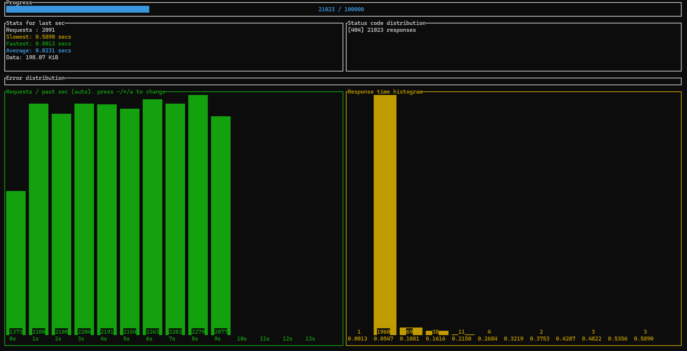
#### Results
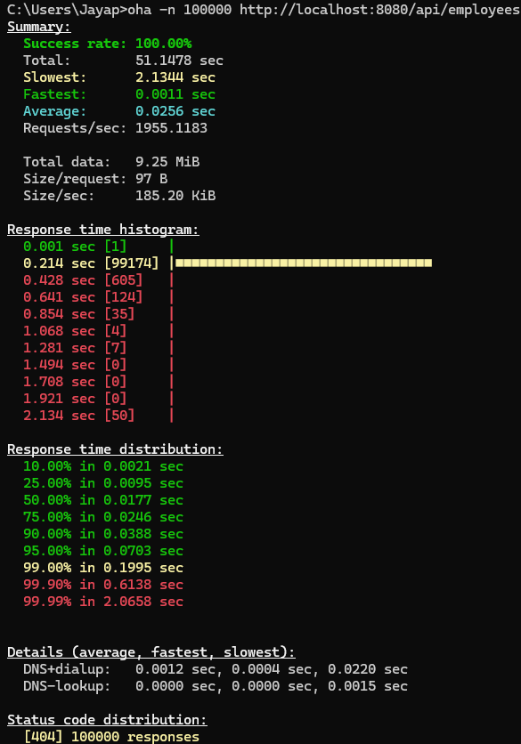


## 4. POST API - Insert 100000 records into MongoDB
```
oha -n 100000 http://localhost:8080/api/employees/new -m POST
```

#### Progress
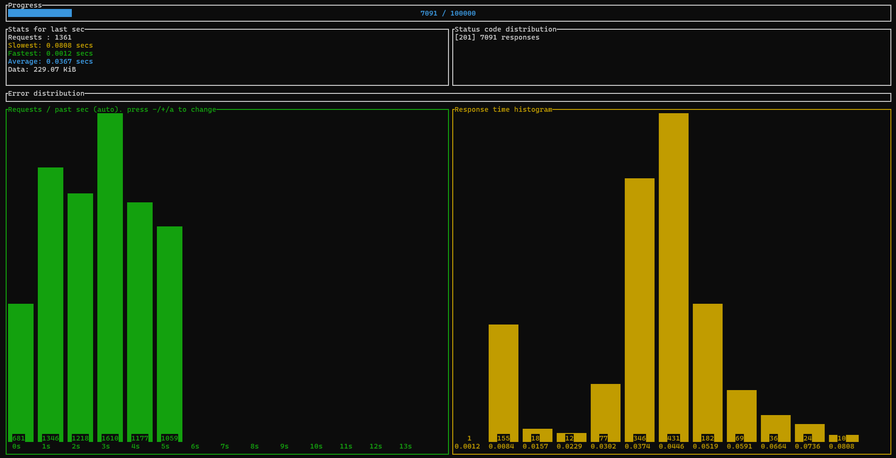
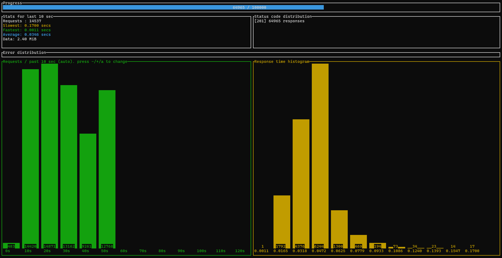

#### Results
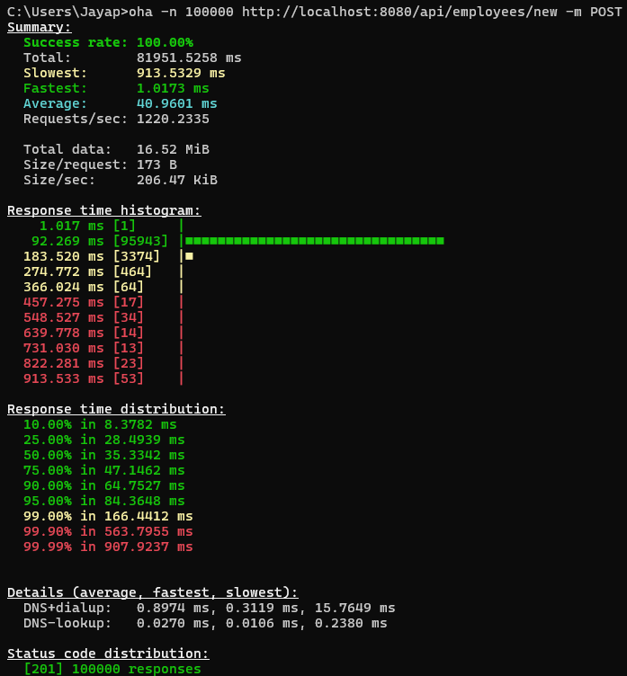

## 5. GET API - (After inserting 100000 records)
```
oha -n 100000 http://localhost:8080/api/employees/
```

#### Progress
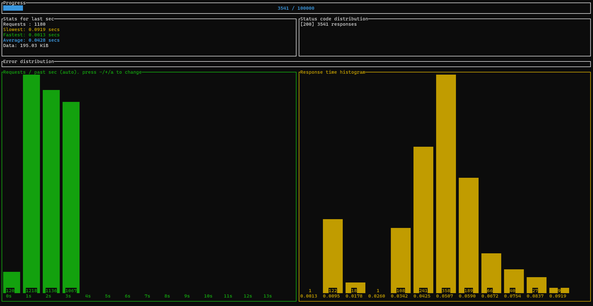
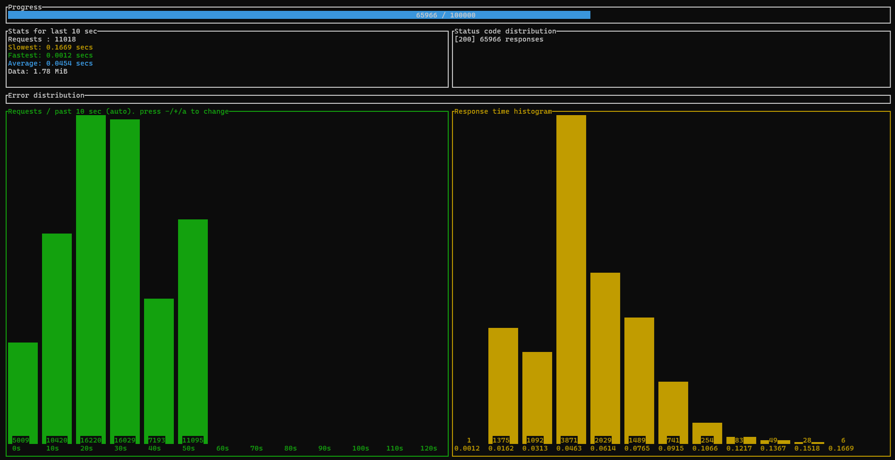

#### Results
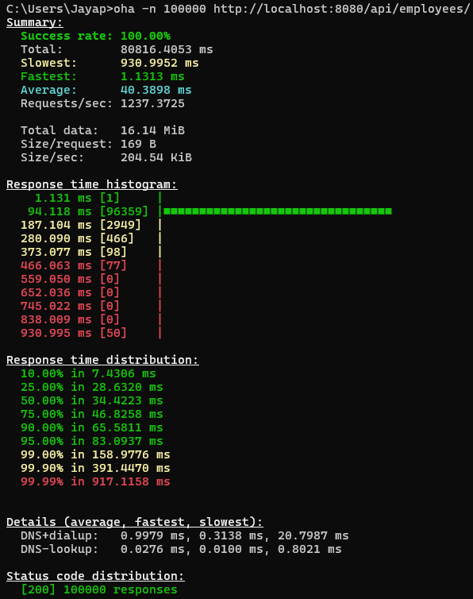
