# Application using GraalVM JDK 25

## 0. Pre-requesties
* Install GraalVM JDK 25 https://www.graalvm.org/latest/getting-started/windows/

## 1. Build

```
mvnw.cmd -Didea.version=2025.2.3 -Dmaven.ext.class.path=C:\Program Files\JetBrains\IntelliJ IDEA 2025.2.1\plugins\maven\lib\maven-event-listener.jar -Djansi.passthrough=true -Dstyle.color=always -DskipTests=true -Dmaven.repo.local=C:\Users\Jayap\.m2\repository org.graalvm.buildtools:native-maven-plugin:0.11.1:compile -f pom.xml
WARNING: A terminally deprecated method in sun.misc.Unsafe has been called
WARNING: sun.misc.Unsafe::staticFieldBase has been called by com.google.inject.internal.aop.HiddenClassDefiner (file:/C:/Users/Jayap/.m2/wrapper/dists/apache-maven-3.9.11/03d7e36a140982eea48e22c1dcac01d8862b2550b2939e09a0809bbc5182a5bc/lib/guice-5.1.0-classes.jar)
WARNING: Please consider reporting this to the maintainers of class com.google.inject.internal.aop.HiddenClassDefiner
WARNING: sun.misc.Unsafe::staticFieldBase will be removed in a future release
[INFO] Scanning for projects...
[INFO]
[INFO] ----------< io.jayaprabahar.graalvm:graalvm-performance-test >----------
[INFO] Building graalvm-performance-test 0.0.1-SNAPSHOT
[INFO]   from pom.xml
[INFO] --------------------------------[ jar ]---------------------------------
[INFO]
[INFO] >>> native:0.11.1:compile (default-cli) > package @ graalvm-performance-test >>>
[INFO]
[INFO] --- resources:3.3.1:resources (default-resources) @ graalvm-performance-test ---
[INFO] Copying 1 resource from src\main\resources to target\classes
[INFO] Copying 0 resource from src\main\resources to target\classes
[INFO]
[INFO] --- compiler:3.11.0:compile (default-compile) @ graalvm-performance-test ---
[INFO] Changes detected - recompiling the module! :source
[INFO] Compiling 5 source files with javac [forked debug release 25] to target\classes
[WARNING] WARNING: A terminally deprecated method in sun.misc.Unsafe has been called
WARNING: sun.misc.Unsafe:objectFieldOffset has been called by lombok.permit.Permit
WARNING: Please consider reporting this to the maintainers of class lombok.permit.Permit
WARNING: sun.misc.Unsafe:objectFieldOffset will be removed in a future release
C:\Users\Jayap\IdeaProjects\graalvm-performance-test\src\main\java\io\jayaprabahar\graalvm\graalvm_performance_test\employee\Employee.java:[26,26] @Builder will ignore the initializing expression entirely. If you want the initializing expression to serve as default, add @Builder.Default. If it is not supposed to be settable during building, make the field final.
[INFO]
[INFO] --- resources:3.3.1:testResources (default-testResources) @ graalvm-performance-test ---
[INFO] skip non existing resourceDirectory C:\Users\Jayap\IdeaProjects\graalvm-performance-test\src\test\resources
[INFO]
[INFO] --- compiler:3.11.0:testCompile (default-testCompile) @ graalvm-performance-test ---
[INFO] Changes detected - recompiling the module! :dependency
[INFO] Compiling 1 source file with javac [forked debug release 25] to target\test-classes
[INFO]
[INFO] --- surefire:3.5.4:test (default-test) @ graalvm-performance-test ---
[WARNING]  Parameter 'systemProperties' is deprecated: Use systemPropertyVariables instead.
[INFO] Tests are skipped.
[INFO]
[INFO] --- jar:3.4.2:jar (default-jar) @ graalvm-performance-test ---
[INFO] Building jar: C:\Users\Jayap\IdeaProjects\graalvm-performance-test\target\graalvm-performance-test-0.0.1-SNAPSHOT.jar
[INFO]
[INFO] --- spring-boot:4.0.0-SNAPSHOT:repackage (repackage) @ graalvm-performance-test ---
[INFO] Replacing main artifact C:\Users\Jayap\IdeaProjects\graalvm-performance-test\target\graalvm-performance-test-0.0.1-SNAPSHOT.jar with repackaged archive, adding nested dependencies in BOOT-INF/.
[INFO] The original artifact has been renamed to C:\Users\Jayap\IdeaProjects\graalvm-performance-test\target\graalvm-performance-test-0.0.1-SNAPSHOT.jar.original
[INFO]
[INFO] <<< native:0.11.1:compile (default-cli) < package @ graalvm-performance-test <<<
[INFO]
[INFO]
[INFO] --- native:0.11.1:compile (default-cli) @ graalvm-performance-test ---
[INFO] Found GraalVM installation from JAVA_HOME variable.
[INFO] Downloaded GraalVM reachability metadata repository from file:/C:/Users/Jayap/.m2/repository/org/graalvm/buildtools/graalvm-reachability-metadata/0.11.1/graalvm-reachability-metadata-0.11.1-repository.zip
[INFO] [graalvm reachability metadata repository for ch.qos.logback:logback-classic:1.5.19]: Configuration directory not found. Trying latest version.
[INFO] [graalvm reachability metadata repository for ch.qos.logback:logback-classic:1.5.19]: Configuration directory is ch.qos.logback\logback-classic\1.4.9
[INFO] [graalvm reachability metadata repository for commons-logging:commons-logging:1.3.5]: Configuration directory is commons-logging\commons-logging\1.2
[INFO] [graalvm reachability metadata repository for org.apache.tomcat.embed:tomcat-embed-core:11.0.11]: Configuration directory not found. Trying latest version.
[INFO] [graalvm reachability metadata repository for org.apache.tomcat.embed:tomcat-embed-core:11.0.11]: Configuration directory is org.apache.tomcat.embed\tomcat-embed-core\10.0.20
[WARNING] Properties file at 'jar:file:///C:/Users/Jayap/.m2/repository/org/mongodb/bson/5.6.0/bson-5.6.0.jar!/META-INF/native-image/native-image.properties' does not match the recommended 'META-INF/native-image/org.mongodb/bson/native-image.properties' layout.
[WARNING] Properties file at 'jar:file:///C:/Users/Jayap/.m2/repository/org/mongodb/mongodb-driver-core/5.6.0/mongodb-driver-core-5.6.0.jar!/META-INF/native-image/native-image.properties' does not match the recommended 'META-INF/native-image/org.mongodb/mongodb-driver-core/native-image.properties' layout.
[INFO] [graalvm reachability metadata repository for org.hdrhistogram:HdrHistogram:2.2.2]: Configuration directory not found. Trying latest version.
[INFO] [graalvm reachability metadata repository for org.hdrhistogram:HdrHistogram:2.2.2]: Configuration directory is org.hdrhistogram\HdrHistogram\2.1.12
[INFO] CycloneDX: Resolving Dependencies
[INFO] CycloneDX: Creating BOM version 1.5 with 67 component(s)
[INFO] CycloneDX: Writing and validating BOM (JSON): C:\Users\Jayap\IdeaProjects\graalvm-performance-test\target\base_sbom.json
[INFO]            attaching as graalvm-performance-test-0.0.1-SNAPSHOT-cyclonedx.json
[WARNING] No jdk toolchain configuration found
[INFO] Executing: C:\Users\Jayap\.jdks\graalvm-jdk-25\bin\native-image.cmd @target\tmp\native-image-14374824817288008746.args io.jayaprabahar.graalvm.graalvm_performance_test.GraalvmPerformanceTestApplication
Warning: Option 'DynamicProxyConfigurationResources' is deprecated and might be removed in a future release: This can be caused by a proxy-config.json file in your META-INF directory. Consider including proxy configuration in the reflection section of reachability-metadata.md instead.. Please refer to the GraalVM release notes.
========================================================================================================================
GraalVM Native Image: Generating 'graalvm-performance-test.exe' (executable)...
========================================================================================================================
For detailed information and explanations on the build output, visit:
https://github.com/oracle/graal/blob/master/docs/reference-manual/native-image/BuildOutput.md
------------------------------------------------------------------------------------------------------------------------
[1/8] Initializing...                                                                                   (34.7s @ 0.25GB)
Java version: 25+37-LTS, vendor version: Oracle GraalVM 25+37.1
Graal compiler: optimization level: b, target machine: x86-64-v3, PGO: off
C compiler: cl.exe (microsoft, x64, 19.44.35217)
Garbage collector: Serial GC (max heap size: 80% of RAM)
2 user-specific feature(s):
- com.oracle.svm.thirdparty.gson.GsonFeature
- org.springframework.aot.nativex.feature.PreComputeFieldFeature
------------------------------------------------------------------------------------------------------------------------
Build resources:
- 17.48GB of memory (51.4% of system memory, using available memory)
- 4 thread(s) (100.0% of 4 available processor(s), determined at start)
  [2/8] Performing analysis...  [*******]                                                                (131.3s @ 1.18GB)
  11,331 types,  16,214 fields, and  57,580 methods found reachable
  4,007 types,     139 fields, and   2,733 methods registered for reflection
  78 types,      60 fields, and      68 methods registered for JNI access
  0 downcalls and 0 upcalls registered for foreign access
  5 native libraries: crypt32, ncrypt, psapi, version, winhttp
  [3/8] Building universe...                                                                              (16.2s @ 1.35GB)
  [4/8] Parsing methods...      [***]                                                                     (10.2s @ 1.45GB)
  [5/8] Inlining methods...     [***]                                                                      (5.3s @ 1.55GB)
  [6/8] Compiling methods...    [********]                                                                (67.0s @ 1.32GB)
  [7/8] Laying out methods...   [***]                                                                      (9.3s @ 1.64GB)
  [8/8] Creating image...       [***]                                                                      (7.8s @ 1.90GB)
  19.91MB (46.44%) for code area:    37,830 compilation units
  21.76MB (50.74%) for image heap:  316,229 objects and 246 resources
  1.21MB ( 2.83%) for other data
  42.89MB in total image size, 42.89MB in total file size
------------------------------------------------------------------------------------------------------------------------
Top 10 origins of code area:                                Top 10 object types in image heap:
9.04MB java.base                                            5.78MB byte[] for code metadata
3.62MB svm.jar (Native Image)                               3.70MB byte[] for java.lang.String
2.19MB java.xml                                             2.04MB java.lang.String
1.27MB tomcat-embed-core-11.0.11.jar                        1.48MB java.lang.Class
387.15kB spring-core-7.0.0-SNAPSHOT.jar                       1.18MB com.oracle.svm.core.hub.DynamicHubCompanion
352.16kB logback-core-1.5.19.jar                            865.60kB byte[] for general heap data
237.37kB java.rmi                                           732.70kB byte[] for embedded resources
223.84kB spring-boot-4.0.0-SNAPSHOT.jar                     613.78kB heap alignment
191.98kB java.management                                    477.47kB java.util.concurrent.ConcurrentHashMap$Node
157.95kB bson-5.6.0.jar                                     388.33kB java.lang.Object[]
1.66MB for 40 more packages                                 4.51MB for 2779 more object types
For more details, open 'graalvm-performance-test-build-report.html'.
------------------------------------------------------------------------------------------------------------------------
Security report:
- Binary includes Java deserialization.
- CycloneDX SBOM with 26 component(s) is embedded in binary (1.21kB). 1 type(s) could not be associated to a component.
- Advanced obfuscation not enabled; enable with '-H:AdvancedObfuscation=""' (experimental support).
------------------------------------------------------------------------------------------------------------------------
Recommendations:
PGO:  Use Profile-Guided Optimizations ('--pgo') for improved throughput.
FUTR: Use '--future-defaults=all' to prepare for future releases.
HEAP: Set max heap for improved and more predictable memory usage.
CPU:  Enable more CPU features with '-march=native' for improved performance.
------------------------------------------------------------------------------------------------------------------------
                       14.6s (5.0% of total time) in 1077 GCs | Peak RSS: 2.75GB | CPU load: 2.49
------------------------------------------------------------------------------------------------------------------------
Build artifacts:
C:\Users\Jayap\IdeaProjects\graalvm-performance-test\target\graalvm-performance-test-build-report.html (build_info)
C:\Users\Jayap\IdeaProjects\graalvm-performance-test\target\graalvm-performance-test.exe (executable)
========================================================================================================================
Finished generating 'graalvm-performance-test' in 4m 48s.
[INFO] ------------------------------------------------------------------------
[INFO] BUILD SUCCESS
[INFO] ------------------------------------------------------------------------
[INFO] Total time:  05:45 min
[INFO] Finished at: 2025-10-14T09:55:38+02:00
[INFO] ------------------------------------------------------------------------

```


### 1.1 Image Size
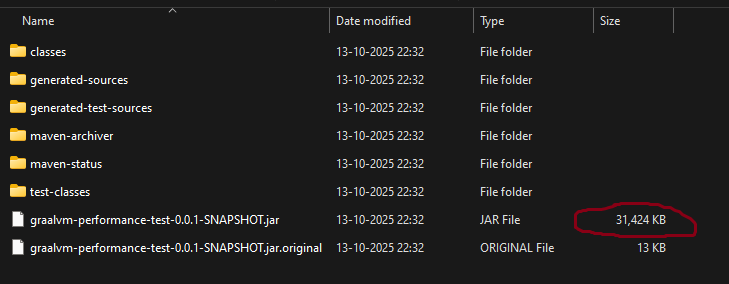

### 1.1 Time to Build


## 2. Start-up Time

```
.   ____          _            __ _ _
/\\ / ___'_ __ _ _(_)_ __  __ _ \ \ \ \
( ( )\___ | '_ | '_| | '_ \/ _` | \ \ \ \
\\/  ___)| |_)| | | | | || (_| |  ) ) ) )
'  |____| .__|_| |_|_| |_\__, | / / / /
=========|_|==============|___/=/_/_/_/

:: Spring Boot ::       (v4.0.0-SNAPSHOT)

2025-10-14T01:20:07.473+02:00  INFO 10192 --- [graalvm-performance-test] [           main] [ ] .j.g.g.GraalvmPerformanceTestApplication : Starting GraalvmPerformanceTestApplication using Java 25 with PID 10192 (C:\Users\Jayap\IdeaProjects\graalvm-performance-test\target\classes started by Jayap in C:\Users\Jayap\IdeaProjects\graalvm-performance-test)
2025-10-14T01:20:07.482+02:00  INFO 10192 --- [graalvm-performance-test] [           main] [ ] .j.g.g.GraalvmPerformanceTestApplication : No active profile set, falling back to 1 default profile: "default"
2025-10-14T01:20:08.887+02:00  INFO 10192 --- [graalvm-performance-test] [           main] [ ] .s.d.r.c.RepositoryConfigurationDelegate : Bootstrapping Spring Data MongoDB repositories in DEFAULT mode.
2025-10-14T01:20:08.972+02:00  INFO 10192 --- [graalvm-performance-test] [           main] [ ] .s.d.r.c.RepositoryConfigurationDelegate : Finished Spring Data repository scanning in 72 ms. Found 1 MongoDB repository interface.
2025-10-14T01:20:09.593+02:00  INFO 10192 --- [graalvm-performance-test] [           main] [ ] o.s.boot.tomcat.TomcatWebServer          : Tomcat initialized with port 8080 (http)
2025-10-14T01:20:09.609+02:00  INFO 10192 --- [graalvm-performance-test] [           main] [ ] o.apache.catalina.core.StandardService   : Starting service [Tomcat]
2025-10-14T01:20:09.610+02:00  INFO 10192 --- [graalvm-performance-test] [           main] [ ] o.apache.catalina.core.StandardEngine    : Starting Servlet engine: [Apache Tomcat/11.0.11]
2025-10-14T01:20:09.664+02:00  INFO 10192 --- [graalvm-performance-test] [           main] [ ] b.w.c.s.WebApplicationContextInitializer : Root WebApplicationContext: initialization completed in 2041 ms
2025-10-14T01:20:10.156+02:00  INFO 10192 --- [graalvm-performance-test] [           main] [ ] org.mongodb.driver.client                : MongoClient with metadata {"driver": {"name": "mongo-java-driver|sync|spring-boot", "version": "5.6.0"}, "os": {"type": "Windows", "name": "Windows 11", "architecture": "amd64", "version": "10.0"}, "platform": "Java/Oracle Corporation/25+36-3489"} created with settings MongoClientSettings{readPreference=primary, writeConcern=WriteConcern{w=null, wTimeout=null ms, journal=null}, retryWrites=true, retryReads=true, readConcern=ReadConcern{level=null}, credential=null, transportSettings=null, commandListeners=[io.micrometer.core.instrument.binder.mongodb.MongoMetricsCommandListener@1efac5b9], codecRegistry=ProvidersCodecRegistry{codecProviders=[ValueCodecProvider{}, BsonValueCodecProvider{}, DBRefCodecProvider{}, DBObjectCodecProvider{}, DocumentCodecProvider{}, CollectionCodecProvider{}, IterableCodecProvider{}, MapCodecProvider{}, GeoJsonCodecProvider{}, GridFSFileCodecProvider{}, Jsr310CodecProvider{}, JsonObjectCodecProvider{}, BsonCodecProvider{}, com.mongodb.client.model.mql.ExpressionCodecProvider@11a3a45f, com.mongodb.Jep395RecordCodecProvider@69796bd0, com.mongodb.KotlinCodecProvider@40df6090, EnumCodecProvider{}]}, loggerSettings=LoggerSettings{maxDocumentLength=1000}, clusterSettings={hosts=[localhost:27017], srvServiceName=mongodb, mode=SINGLE, requiredClusterType=UNKNOWN, requiredReplicaSetName='null', serverSelector='null', clusterListeners='[]', serverSelectionTimeout='30000 ms', localThreshold='15 ms'}, socketSettings=SocketSettings{connectTimeoutMS=10000, readTimeoutMS=0, receiveBufferSize=0, proxySettings=ProxySettings{host=null, port=null, username=null, password=null}}, heartbeatSocketSettings=SocketSettings{connectTimeoutMS=10000, readTimeoutMS=10000, receiveBufferSize=0, proxySettings=ProxySettings{host=null, port=null, username=null, password=null}}, connectionPoolSettings=ConnectionPoolSettings{maxSize=100, minSize=0, maxWaitTimeMS=120000, maxConnectionLifeTimeMS=0, maxConnectionIdleTimeMS=0, maintenanceInitialDelayMS=0, maintenanceFrequencyMS=60000, connectionPoolListeners=[io.micrometer.core.instrument.binder.mongodb.MongoMetricsConnectionPoolListener@8c0a23f], maxConnecting=2}, serverSettings=ServerSettings{heartbeatFrequencyMS=10000, minHeartbeatFrequencyMS=500, serverMonitoringMode=AUTO, serverListeners='[]', serverMonitorListeners='[]'}, sslSettings=SslSettings{enabled=false, invalidHostNameAllowed=false, context=null}, applicationName='null', compressorList=[], uuidRepresentation=UNSPECIFIED, serverApi=null, autoEncryptionSettings=null, dnsClient=null, inetAddressResolver=null, contextProvider=null, timeoutMS=null}
2025-10-14T01:20:10.174+02:00  INFO 10192 --- [graalvm-performance-test] [localhost:27017] [ ] org.mongodb.driver.cluster               : Monitor thread successfully connected to server with description ServerDescription{address=localhost:27017, type=STANDALONE, cryptd=false, state=CONNECTED, ok=true, minWireVersion=0, maxWireVersion=27, maxDocumentSize=16777216, logicalSessionTimeoutMinutes=30, roundTripTimeNanos=31039900, minRoundTripTimeNanos=0}
2025-10-14T01:20:11.225+02:00  INFO 10192 --- [graalvm-performance-test] [           main] [ ] o.s.b.a.e.web.EndpointLinksResolver      : Exposing 2 endpoints beneath base path '/actuator'
2025-10-14T01:20:11.301+02:00  INFO 10192 --- [graalvm-performance-test] [           main] [ ] o.s.boot.tomcat.TomcatWebServer          : Tomcat started on port 8080 (http) with context path '/'
2025-10-14T01:20:11.310+02:00  INFO 10192 --- [graalvm-performance-test] [           main] [ ] .j.g.g.GraalvmPerformanceTestApplication : Started GraalvmPerformanceTestApplication in 4.497 seconds (process running for 6.237)
2025-10-14T01:20:12.034+02:00  INFO 10192 --- [graalvm-performance-test] [)-192.168.1.202] [ ] o.a.c.c.C.[Tomcat].[localhost].[/]       : Initializing Spring DispatcherServlet 'dispatcherServlet'
2025-10-14T01:20:12.036+02:00  INFO 10192 --- [graalvm-performance-test] [)-192.168.1.202] [ ] o.s.web.servlet.DispatcherServlet        : Initializing Servlet 'dispatcherServlet'
2025-10-14T01:20:12.039+02:00  INFO 10192 --- [graalvm-performance-test] [)-192.168.1.202] [ ] o.s.web.servlet.DispatcherServlet        : Completed initialization in 3 ms
```

## 3. GET API - Fetch 100000 records with concurrency 10 from MongoDB

```
oha -n 100000 -c 10 http://localhost:8080/api/employees
```

#### Progress
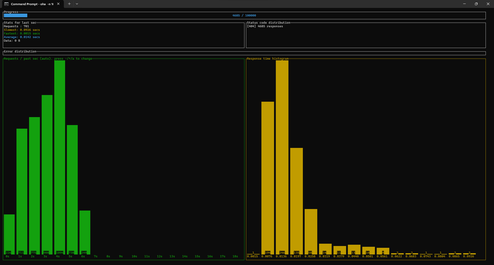
#### Results
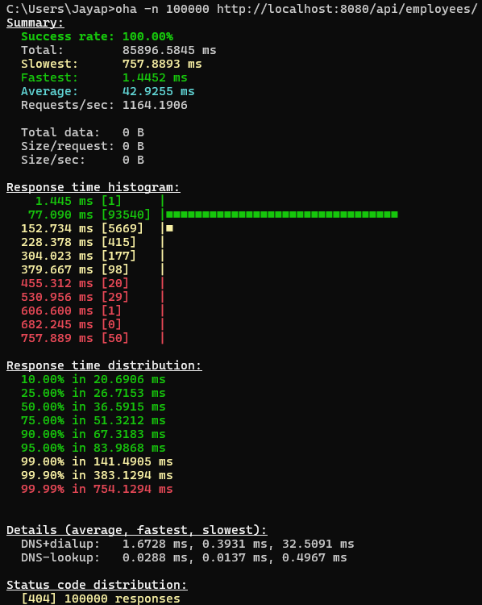


## 4. POST API - Insert 100000 records into MongoDB
```
oha -n 100000 -c 10 http://localhost:8080/api/employees/new -m POST
```

#### Progress

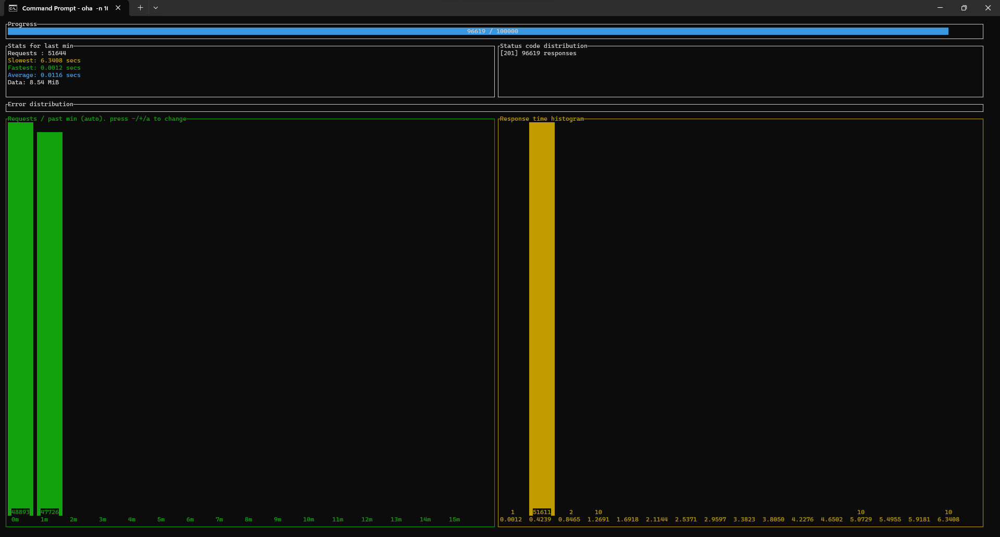

#### Results
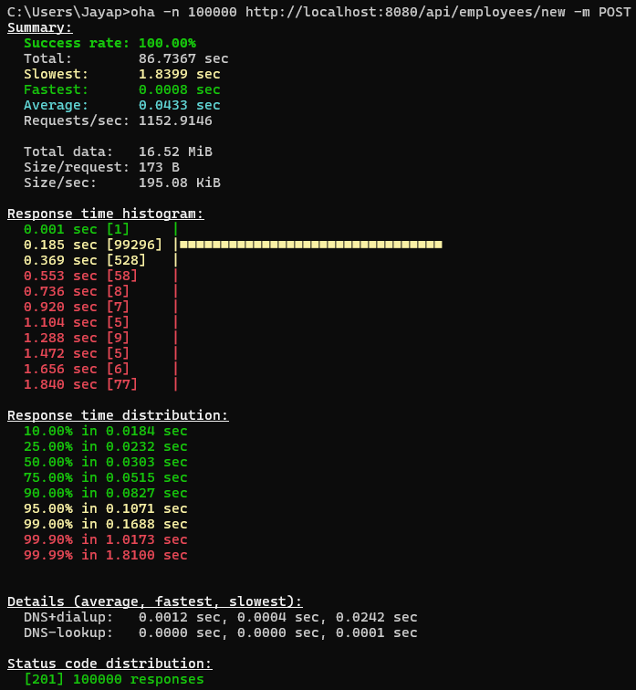

## 5. GET API - (After inserting 100000 records)
```
oha -n 100000 -c 100 http://localhost:8080/api/employees/
```

#### Progress without Index
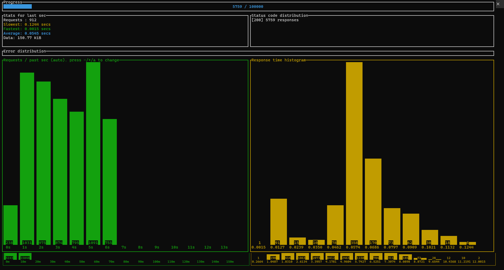
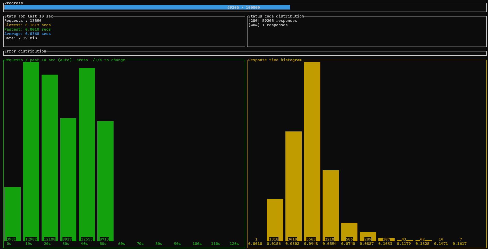

#### Results without Index
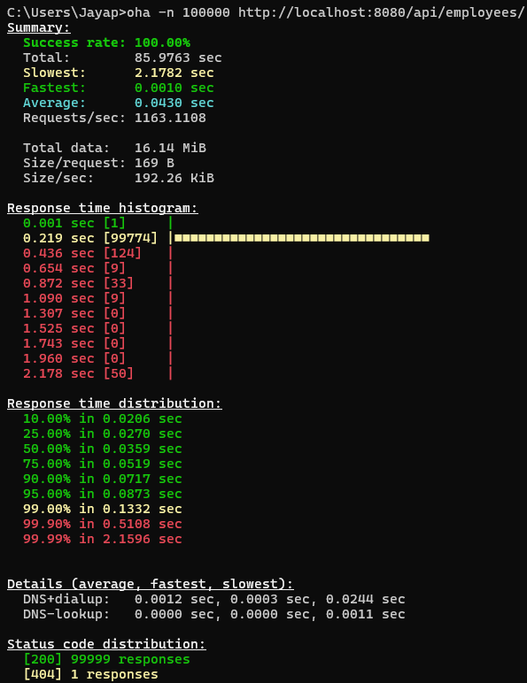
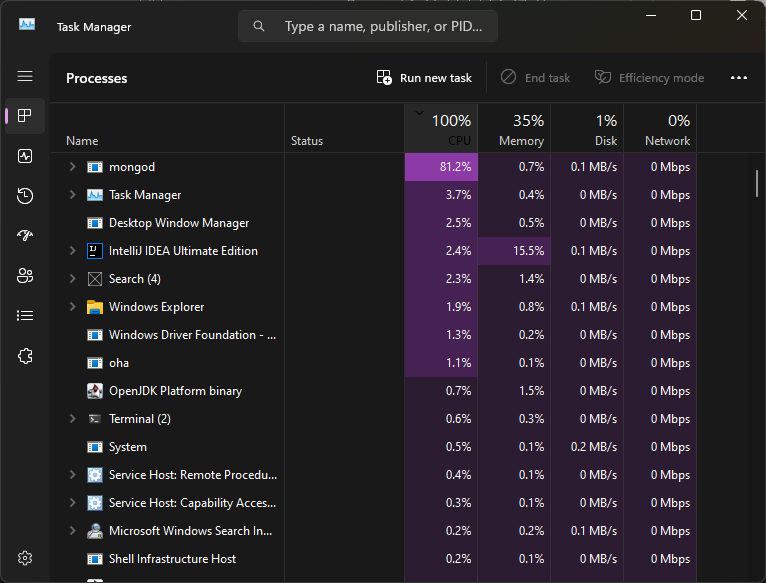

## 5. GET API - (After inserting 100000 records with index)

### Create Index on empId field in MongoDB 
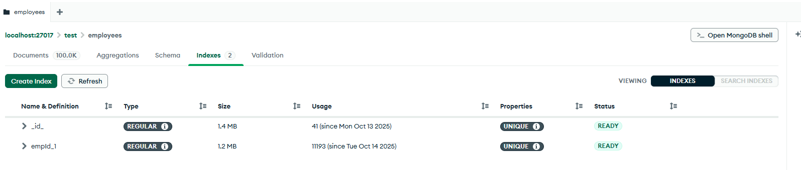

#### Progress with Index
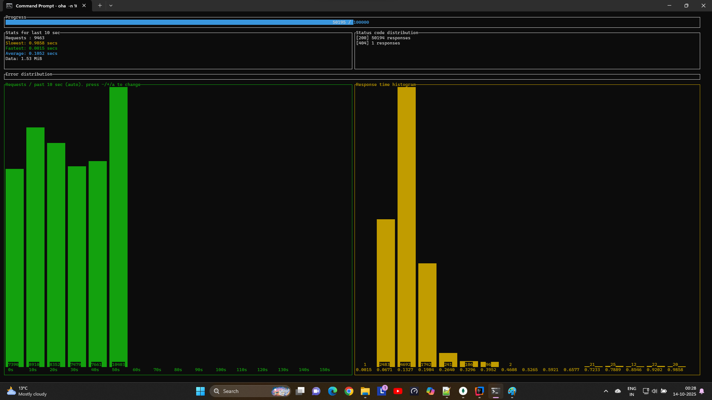
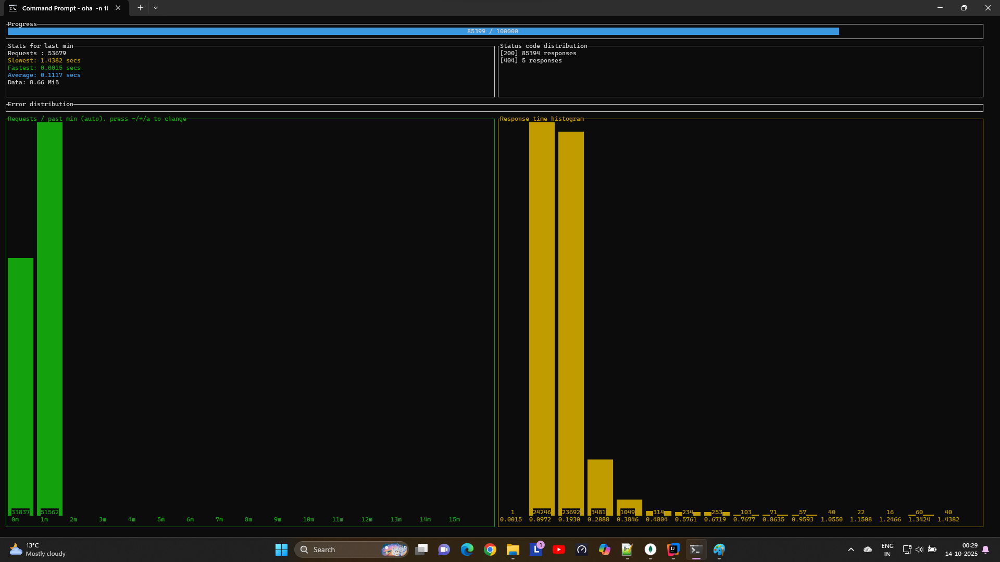

#### Results with Index
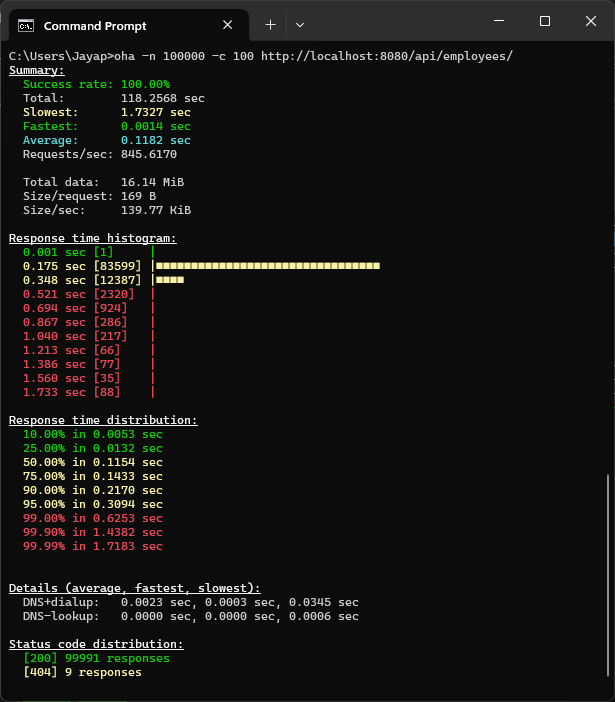