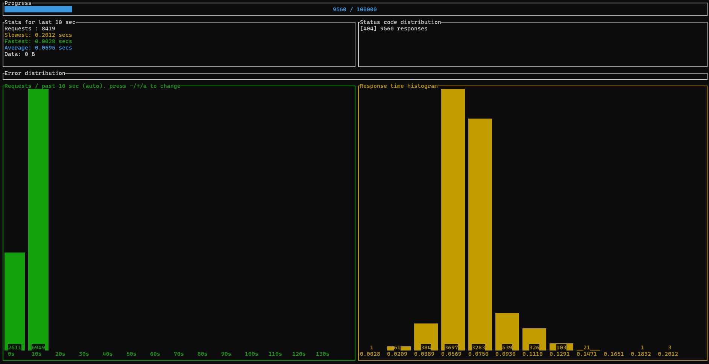
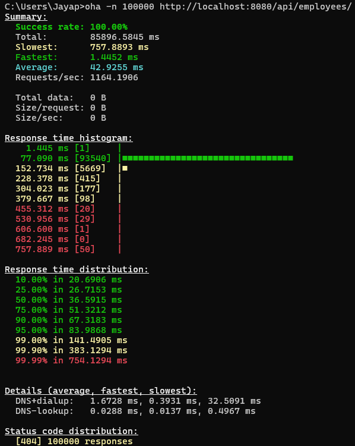
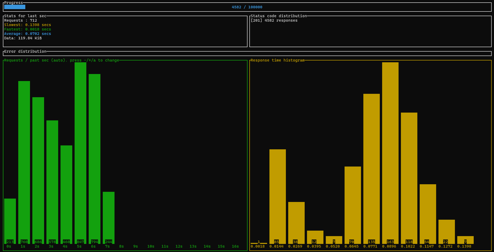
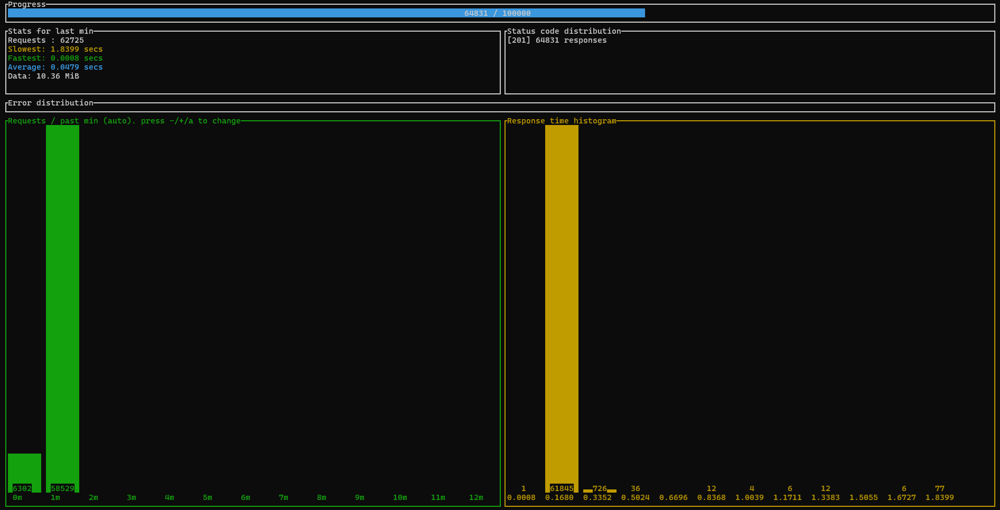
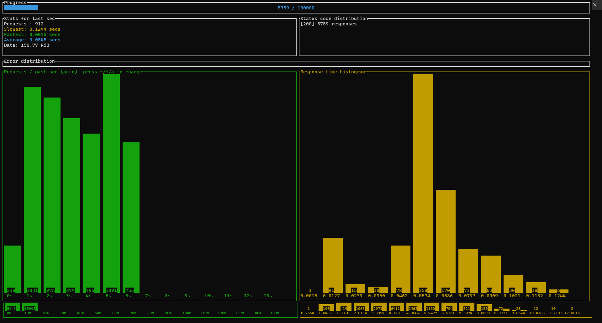
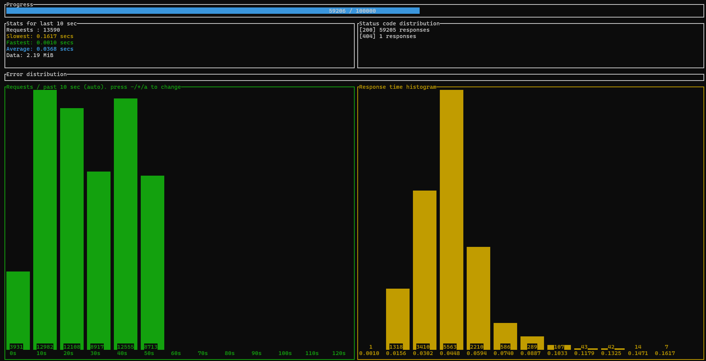

# Application using OpenJDK 25

## 1. Build

### 1.1 Image Size


### 1.1 Time to Build


## 2. Start-up Time

```
C:\Users\Jayap\IdeaProjects\graalvm-performance-test\target>java -jar graalvm-performance-test-0.0.1-SNAPSHOT.jar

  .   ____          _            __ _ _
 /\\ / ___'_ __ _ _(_)_ __  __ _ \ \ \ \
( ( )\___ | '_ | '_| | '_ \/ _` | \ \ \ \
 \\/  ___)| |_)| | | | | || (_| |  ) ) ) )
  '  |____| .__|_| |_|_| |_\__, | / / / /
 =========|_|==============|___/=/_/_/_/

 :: Spring Boot ::       (v4.0.0-SNAPSHOT)

2025-10-20T14:44:59.398+02:00  INFO 7764 --- [graalvm-performance-test] [           main] [                                                 ] .j.g.g.GraalvmPerformanceTestApplication : Starting GraalvmPerformanceTestApplication v0.0.1-SNAPSHOT using Java 25 with PID 7764 (C:\Users\Jayap\IdeaProjects\graalvm-performance-test\target\graalvm-performance-test-0.0.1-SNAPSHOT.jar started by Jayap in C:\Users\Jayap\IdeaProjects\graalvm-performance-test\target)
2025-10-20T14:44:59.412+02:00  INFO 7764 --- [graalvm-performance-test] [           main] [                                                 ] .j.g.g.GraalvmPerformanceTestApplication : No active profile set, falling back to 1 default profile: "default"
2025-10-20T14:45:00.849+02:00  INFO 7764 --- [graalvm-performance-test] [           main] [                                                 ] .s.d.r.c.RepositoryConfigurationDelegate : Bootstrapping Spring Data MongoDB repositories in DEFAULT mode.
2025-10-20T14:45:00.959+02:00  INFO 7764 --- [graalvm-performance-test] [           main] [                                                 ] .s.d.r.c.RepositoryConfigurationDelegate : Finished Spring Data repository scanning in 90 ms. Found 1 MongoDB repository interface.
2025-10-20T14:45:01.732+02:00  INFO 7764 --- [graalvm-performance-test] [           main] [                                                 ] o.s.boot.tomcat.TomcatWebServer          : Tomcat initialized with port 8080 (http)
2025-10-20T14:45:01.758+02:00  INFO 7764 --- [graalvm-performance-test] [           main] [                                                 ] o.apache.catalina.core.StandardService   : Starting service [Tomcat]
2025-10-20T14:45:01.758+02:00  INFO 7764 --- [graalvm-performance-test] [           main] [                                                 ] o.apache.catalina.core.StandardEngine    : Starting Servlet engine: [Apache Tomcat/11.0.13]
2025-10-20T14:45:01.817+02:00  INFO 7764 --- [graalvm-performance-test] [           main] [                                                 ] b.w.c.s.WebApplicationContextInitializer : Root WebApplicationContext: initialization completed in 2258 ms
2025-10-20T14:45:02.423+02:00  INFO 7764 --- [graalvm-performance-test] [           main] [                                                 ] org.mongodb.driver.client                : MongoClient with metadata {"driver": {"name": "mongo-java-driver|spring-boot|sync", "version": "5.6.1"}, "os": {"type": "Windows", "name": "Windows 11", "architecture": "amd64", "version": "10.0"}, "platform": "Java/Oracle Corporation/25+37-LTS-jvmci-b01"} created with settings MongoClientSettings{readPreference=primary, writeConcern=WriteConcern{w=null, wTimeout=null ms, journal=null}, retryWrites=true, retryReads=true, readConcern=ReadConcern{level=null}, credential=null, transportSettings=null, commandListeners=[io.micrometer.core.instrument.binder.mongodb.MongoMetricsCommandListener@415d88de], codecRegistry=ProvidersCodecRegistry{codecProviders=[ValueCodecProvider{}, BsonValueCodecProvider{}, DBRefCodecProvider{}, DBObjectCodecProvider{}, DocumentCodecProvider{}, CollectionCodecProvider{}, IterableCodecProvider{}, MapCodecProvider{}, GeoJsonCodecProvider{}, GridFSFileCodecProvider{}, Jsr310CodecProvider{}, JsonObjectCodecProvider{}, BsonCodecProvider{}, com.mongodb.client.model.mql.ExpressionCodecProvider@a0bf272, com.mongodb.Jep395RecordCodecProvider@4a89ef44, com.mongodb.KotlinCodecProvider@310a7859, EnumCodecProvider{}]}, loggerSettings=LoggerSettings{maxDocumentLength=1000}, clusterSettings={hosts=[localhost:27017], srvServiceName=mongodb, mode=SINGLE, requiredClusterType=UNKNOWN, requiredReplicaSetName='null', serverSelector='null', clusterListeners='[]', serverSelectionTimeout='30000 ms', localThreshold='15 ms'}, socketSettings=SocketSettings{connectTimeoutMS=10000, readTimeoutMS=0, receiveBufferSize=0, proxySettings=ProxySettings{host=null, port=null, username=null, password=null}}, heartbeatSocketSettings=SocketSettings{connectTimeoutMS=10000, readTimeoutMS=10000, receiveBufferSize=0, proxySettings=ProxySettings{host=null, port=null, username=null, password=null}}, connectionPoolSettings=ConnectionPoolSettings{maxSize=100, minSize=0, maxWaitTimeMS=120000, maxConnectionLifeTimeMS=0, maxConnectionIdleTimeMS=0, maintenanceInitialDelayMS=0, maintenanceFrequencyMS=60000, connectionPoolListeners=[io.micrometer.core.instrument.binder.mongodb.MongoMetricsConnectionPoolListener@1cbc1dde], maxConnecting=2}, serverSettings=ServerSettings{heartbeatFrequencyMS=10000, minHeartbeatFrequencyMS=500, serverMonitoringMode=AUTO, serverListeners='[]', serverMonitorListeners='[]'}, sslSettings=SslSettings{enabled=false, invalidHostNameAllowed=false, context=null}, applicationName='null', compressorList=[], uuidRepresentation=UNSPECIFIED, serverApi=null, autoEncryptionSettings=null, dnsClient=null, inetAddressResolver=null, contextProvider=null, timeoutMS=null}
2025-10-20T14:45:02.470+02:00  INFO 7764 --- [graalvm-performance-test] [localhost:27017] [                                                 ] org.mongodb.driver.cluster               : Monitor thread successfully connected to server with description ServerDescription{address=localhost:27017, type=STANDALONE, cryptd=false, state=CONNECTED, ok=true, minWireVersion=0, maxWireVersion=27, maxDocumentSize=16777216, logicalSessionTimeoutMinutes=30, roundTripTimeNanos=40895700, minRoundTripTimeNanos=0}
2025-10-20T14:45:03.749+02:00  INFO 7764 --- [graalvm-performance-test] [           main] [                                                 ] o.s.b.a.e.web.EndpointLinksResolver      : Exposing 2 endpoints beneath base path '/actuator'
2025-10-20T14:45:03.853+02:00  INFO 7764 --- [graalvm-performance-test] [           main] [                                                 ] o.s.boot.tomcat.TomcatWebServer          : Tomcat started on port 8080 (http) with context path '/'
2025-10-20T14:45:03.872+02:00  INFO 7764 --- [graalvm-performance-test] [           main] [                                                 ] .j.g.g.GraalvmPerformanceTestApplication : Started GraalvmPerformanceTestApplication in 5.304 seconds (process running for 6.325)
```

## 3. GET API - Fetch 100000 records from MongoDB

```
oha -n 100000 http://localhost:8080/api/employees
```

#### Progress

#### Results



## 4. POST API - Insert 100000 records into MongoDB
```
oha -n 100000 http://localhost:8080/api/employees/new -m POST
```

#### Progress



#### Results


## 5. GET API - (After inserting 100000 records)
```
oha -n 1000000 http://localhost:8080/api/employees/
```

#### Progress with Index



#### Results with Index
