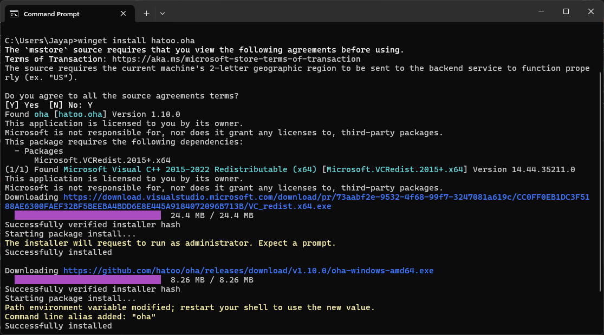
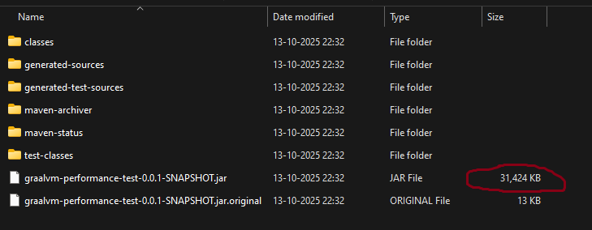
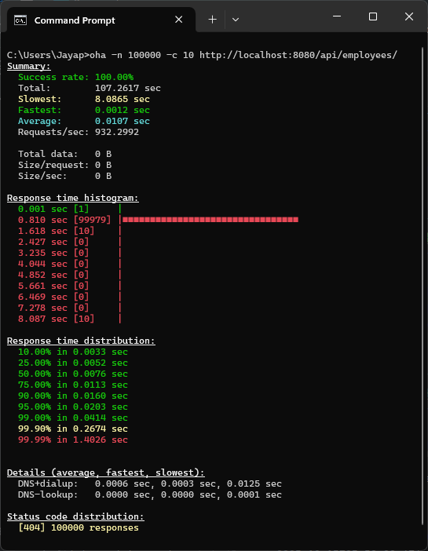
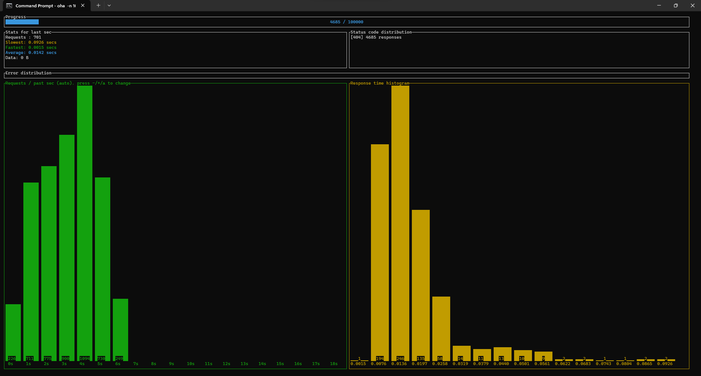

# Application

Created a Simple Employee CRUD API application using SpringBoot 4.* and Java 25. Have controller, Service, Repository & Entity Classes.
Connected to MongoDB.

# Installation of oha
oha is a tiny TUI based program that sends some load to a web application and show realtime tui inspired by rakyll/hey.
We are going to use this for load testing our application.

https://github.com/hatoo/oha

Installation: -

# Application using OpenJDK 25
Build Image Size 

## Fetch 100000 records with concurrency 10 from MongoDB using GET API
oha -n 100000 -c 10 http://localhost:8080/api/employees

## Insert 100000 records into MongoDB using POST API
oha -n 100000 -c 10 http://localhost:8080/api/employees/new -m POST

## Fetch 100000 records with concurrency 100 from MongoDB using GET API (After inserting 100000 records)
oha -n 100000 -c 100 http://localhost:8080/api/employees/