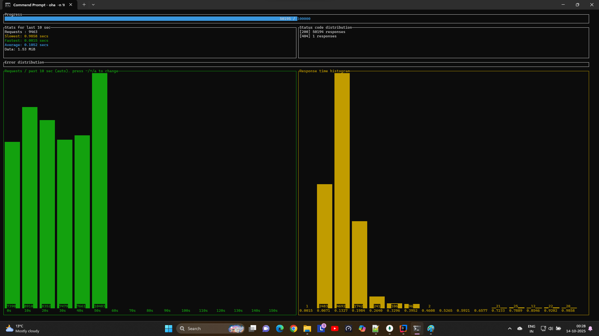

# Application using OpenJDK 25

## 1. Build Image Size 


## 2. Fetch 100000 records with concurrency 10 from MongoDB using GET API

```
oha -n 100000 -c 10 http://localhost:8080/api/employees
```

#### Progress

#### Results


## 3. Insert 100000 records into MongoDB using POST API
```
oha -n 100000 -c 10 http://localhost:8080/api/employees/new -m POST
```

#### Progress


#### Results


## 4. Fetch 100000 records with concurrency 100 from MongoDB using GET API (After inserting 100000 records)
```
oha -n 100000 -c 100 http://localhost:8080/api/employees/
```

#### Progress without Index


#### Results without Index


## 5. Fetch 100000 records with concurrency 100 from MongoDB using GET API (After inserting 100000 records with index)

### Create Index on empId field in MongoDB 


#### Progress with Index



#### Results with Index
