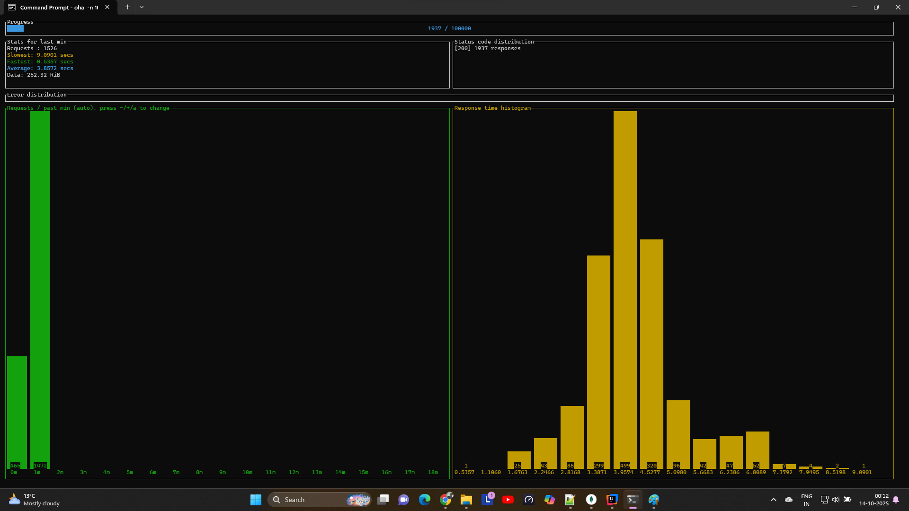

# Application using OpenJDK 25

## 1. Build

### 1.1 Image Size


### 1.1 Time to Build


## 2. Start-up Time

```
.   ____          _            __ _ _
/\\ / ___'_ __ _ _(_)_ __  __ _ \ \ \ \
( ( )\___ | '_ | '_| | '_ \/ _` | \ \ \ \
\\/  ___)| |_)| | | | | || (_| |  ) ) ) )
'  |____| .__|_| |_|_| |_\__, | / / / /
=========|_|==============|___/=/_/_/_/

:: Spring Boot ::       (v4.0.0-SNAPSHOT)

2025-10-14T01:20:07.473+02:00  INFO 10192 --- [graalvm-performance-test] [           main] [ ] .j.g.g.GraalvmPerformanceTestApplication : Starting GraalvmPerformanceTestApplication using Java 25 with PID 10192 (C:\Users\Jayap\IdeaProjects\graalvm-performance-test\target\classes started by Jayap in C:\Users\Jayap\IdeaProjects\graalvm-performance-test)
2025-10-14T01:20:07.482+02:00  INFO 10192 --- [graalvm-performance-test] [           main] [ ] .j.g.g.GraalvmPerformanceTestApplication : No active profile set, falling back to 1 default profile: "default"
2025-10-14T01:20:08.887+02:00  INFO 10192 --- [graalvm-performance-test] [           main] [ ] .s.d.r.c.RepositoryConfigurationDelegate : Bootstrapping Spring Data MongoDB repositories in DEFAULT mode.
2025-10-14T01:20:08.972+02:00  INFO 10192 --- [graalvm-performance-test] [           main] [ ] .s.d.r.c.RepositoryConfigurationDelegate : Finished Spring Data repository scanning in 72 ms. Found 1 MongoDB repository interface.
2025-10-14T01:20:09.593+02:00  INFO 10192 --- [graalvm-performance-test] [           main] [ ] o.s.boot.tomcat.TomcatWebServer          : Tomcat initialized with port 8080 (http)
2025-10-14T01:20:09.609+02:00  INFO 10192 --- [graalvm-performance-test] [           main] [ ] o.apache.catalina.core.StandardService   : Starting service [Tomcat]
2025-10-14T01:20:09.610+02:00  INFO 10192 --- [graalvm-performance-test] [           main] [ ] o.apache.catalina.core.StandardEngine    : Starting Servlet engine: [Apache Tomcat/11.0.11]
2025-10-14T01:20:09.664+02:00  INFO 10192 --- [graalvm-performance-test] [           main] [ ] b.w.c.s.WebApplicationContextInitializer : Root WebApplicationContext: initialization completed in 2041 ms
2025-10-14T01:20:10.156+02:00  INFO 10192 --- [graalvm-performance-test] [           main] [ ] org.mongodb.driver.client                : MongoClient with metadata {"driver": {"name": "mongo-java-driver|sync|spring-boot", "version": "5.6.0"}, "os": {"type": "Windows", "name": "Windows 11", "architecture": "amd64", "version": "10.0"}, "platform": "Java/Oracle Corporation/25+36-3489"} created with settings MongoClientSettings{readPreference=primary, writeConcern=WriteConcern{w=null, wTimeout=null ms, journal=null}, retryWrites=true, retryReads=true, readConcern=ReadConcern{level=null}, credential=null, transportSettings=null, commandListeners=[io.micrometer.core.instrument.binder.mongodb.MongoMetricsCommandListener@1efac5b9], codecRegistry=ProvidersCodecRegistry{codecProviders=[ValueCodecProvider{}, BsonValueCodecProvider{}, DBRefCodecProvider{}, DBObjectCodecProvider{}, DocumentCodecProvider{}, CollectionCodecProvider{}, IterableCodecProvider{}, MapCodecProvider{}, GeoJsonCodecProvider{}, GridFSFileCodecProvider{}, Jsr310CodecProvider{}, JsonObjectCodecProvider{}, BsonCodecProvider{}, com.mongodb.client.model.mql.ExpressionCodecProvider@11a3a45f, com.mongodb.Jep395RecordCodecProvider@69796bd0, com.mongodb.KotlinCodecProvider@40df6090, EnumCodecProvider{}]}, loggerSettings=LoggerSettings{maxDocumentLength=1000}, clusterSettings={hosts=[localhost:27017], srvServiceName=mongodb, mode=SINGLE, requiredClusterType=UNKNOWN, requiredReplicaSetName='null', serverSelector='null', clusterListeners='[]', serverSelectionTimeout='30000 ms', localThreshold='15 ms'}, socketSettings=SocketSettings{connectTimeoutMS=10000, readTimeoutMS=0, receiveBufferSize=0, proxySettings=ProxySettings{host=null, port=null, username=null, password=null}}, heartbeatSocketSettings=SocketSettings{connectTimeoutMS=10000, readTimeoutMS=10000, receiveBufferSize=0, proxySettings=ProxySettings{host=null, port=null, username=null, password=null}}, connectionPoolSettings=ConnectionPoolSettings{maxSize=100, minSize=0, maxWaitTimeMS=120000, maxConnectionLifeTimeMS=0, maxConnectionIdleTimeMS=0, maintenanceInitialDelayMS=0, maintenanceFrequencyMS=60000, connectionPoolListeners=[io.micrometer.core.instrument.binder.mongodb.MongoMetricsConnectionPoolListener@8c0a23f], maxConnecting=2}, serverSettings=ServerSettings{heartbeatFrequencyMS=10000, minHeartbeatFrequencyMS=500, serverMonitoringMode=AUTO, serverListeners='[]', serverMonitorListeners='[]'}, sslSettings=SslSettings{enabled=false, invalidHostNameAllowed=false, context=null}, applicationName='null', compressorList=[], uuidRepresentation=UNSPECIFIED, serverApi=null, autoEncryptionSettings=null, dnsClient=null, inetAddressResolver=null, contextProvider=null, timeoutMS=null}
2025-10-14T01:20:10.174+02:00  INFO 10192 --- [graalvm-performance-test] [localhost:27017] [ ] org.mongodb.driver.cluster               : Monitor thread successfully connected to server with description ServerDescription{address=localhost:27017, type=STANDALONE, cryptd=false, state=CONNECTED, ok=true, minWireVersion=0, maxWireVersion=27, maxDocumentSize=16777216, logicalSessionTimeoutMinutes=30, roundTripTimeNanos=31039900, minRoundTripTimeNanos=0}
2025-10-14T01:20:11.225+02:00  INFO 10192 --- [graalvm-performance-test] [           main] [ ] o.s.b.a.e.web.EndpointLinksResolver      : Exposing 2 endpoints beneath base path '/actuator'
2025-10-14T01:20:11.301+02:00  INFO 10192 --- [graalvm-performance-test] [           main] [ ] o.s.boot.tomcat.TomcatWebServer          : Tomcat started on port 8080 (http) with context path '/'
2025-10-14T01:20:11.310+02:00  INFO 10192 --- [graalvm-performance-test] [           main] [ ] .j.g.g.GraalvmPerformanceTestApplication : Started GraalvmPerformanceTestApplication in 4.497 seconds (process running for 6.237)
2025-10-14T01:20:12.034+02:00  INFO 10192 --- [graalvm-performance-test] [)-192.168.1.202] [ ] o.a.c.c.C.[Tomcat].[localhost].[/]       : Initializing Spring DispatcherServlet 'dispatcherServlet'
2025-10-14T01:20:12.036+02:00  INFO 10192 --- [graalvm-performance-test] [)-192.168.1.202] [ ] o.s.web.servlet.DispatcherServlet        : Initializing Servlet 'dispatcherServlet'
2025-10-14T01:20:12.039+02:00  INFO 10192 --- [graalvm-performance-test] [)-192.168.1.202] [ ] o.s.web.servlet.DispatcherServlet        : Completed initialization in 3 ms
```

## 3. GET API - Fetch 100000 records with concurrency 10 from MongoDB

```
oha -n 100000 -c 10 http://localhost:8080/api/employees
```

#### Progress

#### Results


## 4. POST API - Insert 100000 records into MongoDB
```
oha -n 100000 -c 10 http://localhost:8080/api/employees/new -m POST
```

#### Progress


#### Results


## 5. GET API - (After inserting 100000 records)
```
oha -n 100000 -c 100 http://localhost:8080/api/employees/
```

#### Progress without Index



#### Results without Index


## 5. GET API - (After inserting 100000 records with index)

### Create Index on empId field in MongoDB 


#### Progress with Index


#### Results with Index
